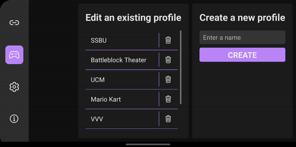
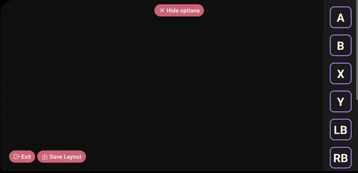
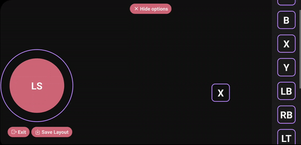
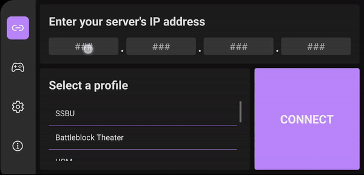

# Virtual Controller for Android and iOS

<b><i> NOTE: 
  
  This is still a work-in-progress app. 
  
  Although it is fully functional at the moment, some minor bugs exist such as errors that sometimes popup when resizing on iOS.
  
  The server also currently works in a .NET coding environment and not as a standalone exectuble program (.exe file).
  
  There are more planned features that include:
  
  1- Full customizability over styling of buttons
  
  2- Resizing and styling customizability of sticks
  
  </i></b> 
  
   
  
  Guide:

First, download the server on your PC and install the app on your smartphone. 

Start up the server and you can start using your smartphone to emulate a controller.

 

## Create multiple profiles for different games

 

## Create your own custom layouts

 

## Adjust the sizes of buttons to your preference

 

## Connect to your PC and start playing!

